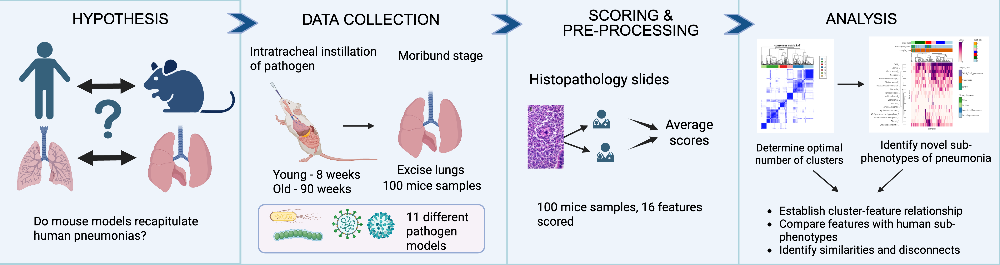

# Pneumonia Sub-phenotypes

# Scripts

## Major scripts
1. Clustering.RMD performs consensus clustering for both human and mouse
2. FiguresV10.RMD creates all the publication figures

## Processing scripts
1. helper_functions.R has all the functions to perform stats and create boxplots/dotplots, some other custom stats/boxplots are in the main script
2. Generate_supplemental_stats_table.R combines all excel stats file into one large excel file

## Setting up environment

Use the renv.lock file to restore the R environment using renv::restore()
R version - 4.2.1

# Data

All the data required will be generated and stored under the data folder

    

